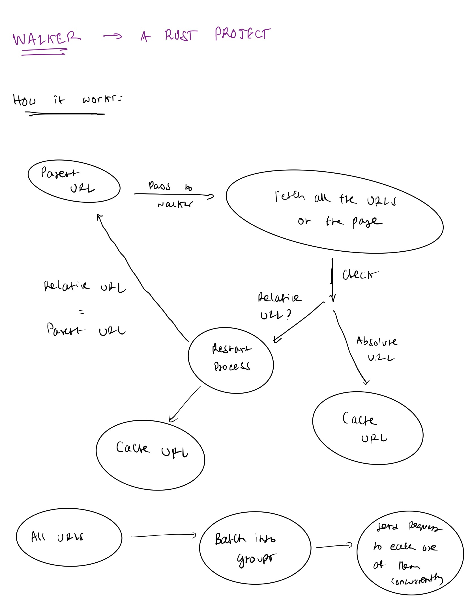

# Walker

Walker is a high‑performance link analysis CLI written in Rust. It recursively crawls a site to discover links and then validates them in parallel to surface broken or misconfigured URLs across a domain.

## At a glance

* **Recursive crawling:** Starts at a root URL and follows internal links through the site.
* **Fast verification:** After discovery, performs concurrent `HEAD` requests to validate links quickly.
* **Actionable output:** Prints HTTP status codes and errors for each URL.
* **Timeouts:** Marks requests that don’t respond within 5 seconds.
* **Simple CLI:** Clean flags for recursion, debugging, DNS checks, and output construction.

## How it works

1. **Discover:** Fetches HTML and extracts links from the current page, then recurses into newly found internal links.
2. **Validate:** Once discovery completes, sends parallel `HEAD` requests to check link health efficiently.



> Note: URL discovery is currently sequential (intentionally simple); verification is concurrent.

## Installation

Ensure you have Cargo installed (see the [official guide](https://doc.rust-lang.org/cargo/getting-started/installation.html)), then run:

```bash
cargo install link-walker
```

Verify installation:

```bash
link-walker -h
```

## Usage

```
Usage: link-walker [OPTIONS] --url <URL>

Options:
  -u, --url <URL>   URL of the website to analyze
  -r, --relative    Perform a recursive deep search (follow internal links)
  -d, --debug       Show the current URL being fetched
  -c, --construct   Construct the response stream into a string and copy to clipboard
  -s, --singular    Check if the domain of the URL is resolvable
  -h, --help        Print help
  -V, --version     Print version
```

Examples:

```bash
# Shallow link check on the root page
link-walker --url "https://ynb.sh"

# Recursive crawl across internal links
link-walker --url "https://ynb.sh" -r
```

Sample output:

```bash
Received 17 links. Iterating now...
https://en.wikipedia.org/wiki/Test_of_English_as_a_Foreign_Language: 200 OK
https://ynb.sh/assets/toefl-listening.png: 200 OK
http://zeroclipboard.org: 500 Internal Server Error
https://github.com/ynbh: 200 OK
Stats
Time to get all links: 1 seconds
Time to verify links: 0 seconds
```

## Limitations and behavior

### Client‑side rendering

Walker analyzes the server‑rendered/static HTML it downloads. Links generated purely on the client (e.g., hydrated by JavaScript) won’t be seen.

### Rate limits

Requests are sent in bursts during validation; some sites may respond with `429 Too Many Requests`. This is a known limitation.

### `HEAD` vs `GET`

Walker uses `HEAD` to save bandwidth. Some servers reject `HEAD` and return `405 Method Not Allowed`, which can lead to false negatives.

### Timeouts

Each request has a 5‑second timeout. If no response is returned within that window, Walker reports a timeout.

### DNS checks

If a URL fails due to DNS resolution, you can confirm domain reachability with:

```bash
link-walker --url <URL> -s
```

## Roadmap

* Optional `--depth <n>` to bound recursion levels.
* Smarter rate‑limit handling (backoff/jitter).
* Optional fallback to `GET` on `405` responses.
* Parallelized discovery phase.

## Why this project

I built Walker to deepen my skills in Rust, networking, and concurrent I/O, while producing a practical CLI for link health checks.
